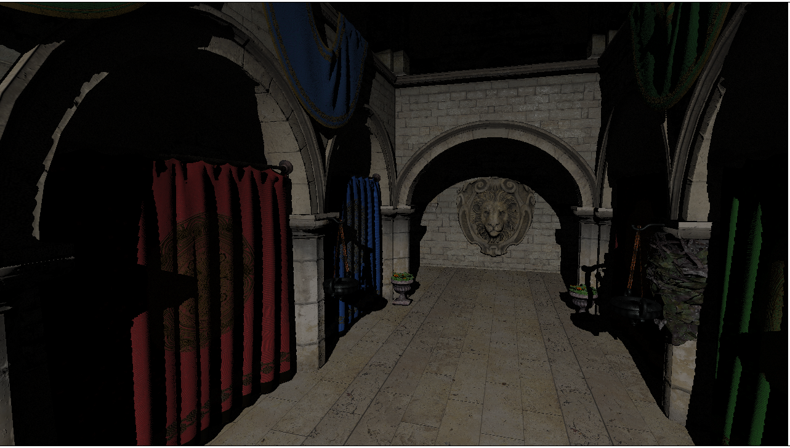
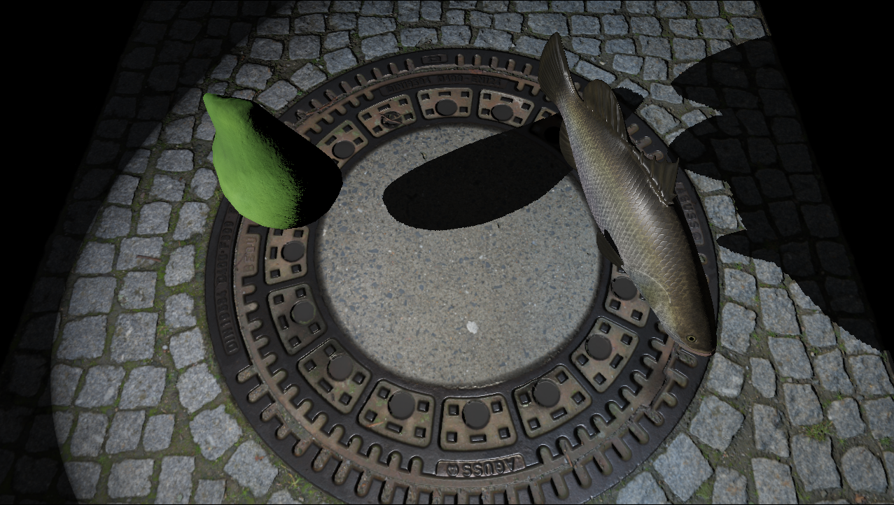
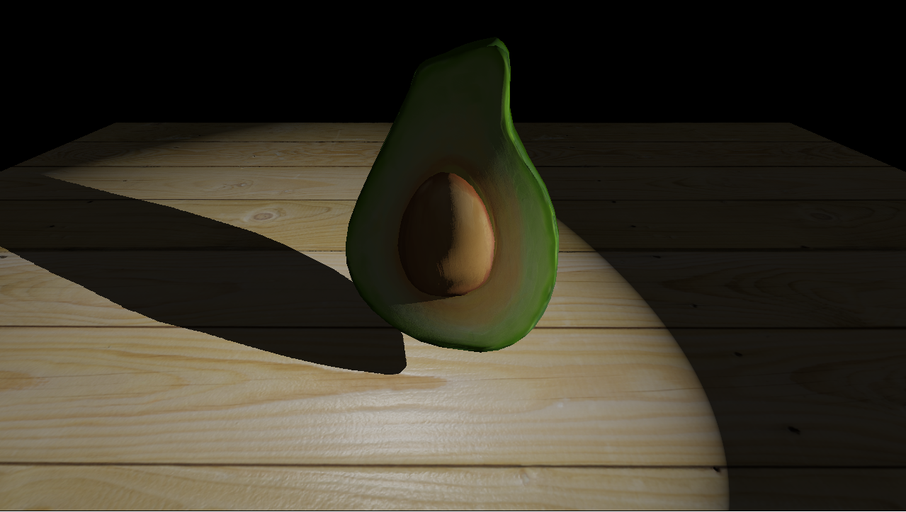
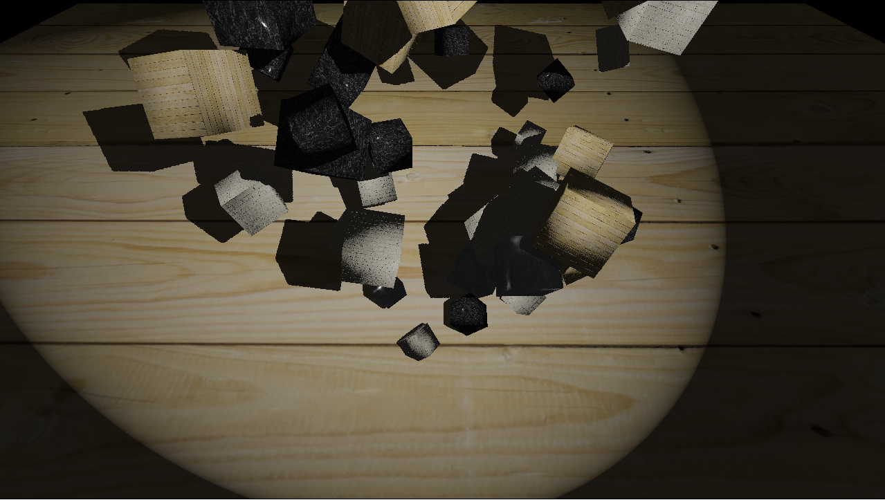
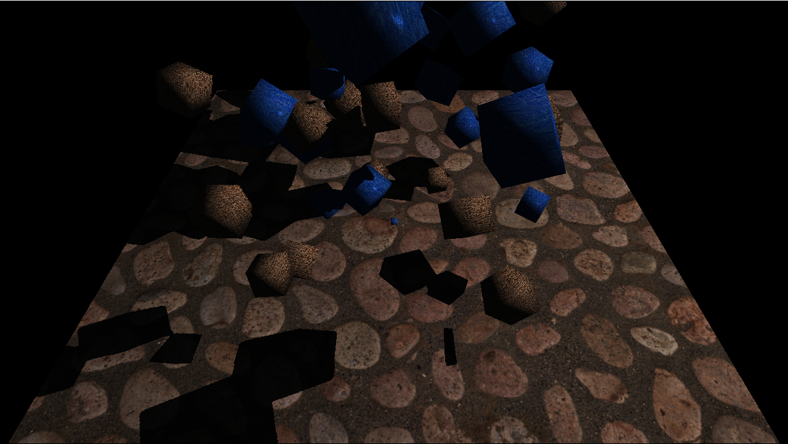

# WebGPU
WebGPU is a new graphics API in the making. It is similar to other modern graphics APIs like Vulkan, DX12 or Metal (https://hacks.mozilla.org/2020/04/experimental-webgpu-in-firefox/). WebGPU has the big advantage of working directly in the browser (currently only in the Canary/Nightly branches) and natively (for example with https://dawn.googlesource.com/dawn) as a standalone application.

Even if it's called **Web**GPU, it isn't limited to the web and could be used for a cross platform render engine with minimal overhead on native platforms without implementing a backend for every graphics API.

To further support this point, this project is entirely written in C99 and uses emscripten, on which I helped to update the WebGPU binding (https://github.com/emscripten-core/emscripten/pull/11067), to compile to WebAssembly (+ HTML/JavaScript glue). Supporting native builds is on the To-Do list.

# Live Demo
If you have a WebGPU compatible browser (https://github.com/gpuweb/gpuweb/wiki/Implementation-Status) you can watch the most recent demo live at https://tandaradei.github.io/

# State of Work
## 2020-06-01

* Added SceneNode tree structure for scene hierarchy
* Improved glTF loading further, to load node transformations and an arbitary numbers of nodes / meshes / primitives / materials
* Changed scene to Sponza which is loaded from glTF consisting of 1 node / 1 mesh / 103 primitives and 25 materials using a total of 69 textures
## 2020-05-24

* Streamlined glTF loading, so that multiple simple (1 mesh/ 1 primitive / 1 material) glTF files can be loaded now
* Improved PBR shader slightly (normals from normal maps were off)
## 2020-05-07

* Avocado model imported from a simple (1 mesh / 1 primitive / 1 material) glTF file (using cgltf to parse the JSON)
## 2020-04-08

* Same scene but now with PBR textures (diffuse, metalness, roughness, normal) and adequate lighting
## 2020-03-27

* Textured cubes that are rotating around their center
* Light + shadow from a spotlight (using a shadow map)
* Phong lighting

# Want to build and run this project on your own?
*I use WSL 1 with Ubuntu 19.10 (https://docs.microsoft.com/en-us/windows/wsl/about) to build and Chrome Canary / Firefox Nightly (both directly on Windows 10) to run*
## Prepare
* Install latest emsdk https://emscripten.org/docs/getting_started/downloads.html
* Install also 
    * CMake
    * glslc
* Clone this repository `git clone https://github.com/Tandaradei/webgpu-wasm`
* `cd webgpu-wasm`
* `git submodule init`
* `git submodule update`

## Build
* cd into the base directory of *webgpu-wasm*
* Needs to be done once at the start of a session
    * `source setup_emscripten.sh` (it assumes that the *emsdk* folder is in the same directory as the *webgpu-wasm* folder)
* emcmake cmake -DCMAKE_BUILD_TYPE=<Release|Debug> build
* cmake --build build
    * The output artifact will be emitted in the *webgpu-wasm/out* directory

## Run
* cd into the base directory of *webgpu-wasm*
* *[Once]* Start a basic web server in the *out* directory
    * for example with `./start_webserver.sh` (automatically starts a simple python web server in the *out* directory)
* Go to **localhost:8080** with a webgpu compatible browser
    * https://github.com/gpuweb/gpuweb/wiki/Implementation-Status
* Choose one of the presented builds